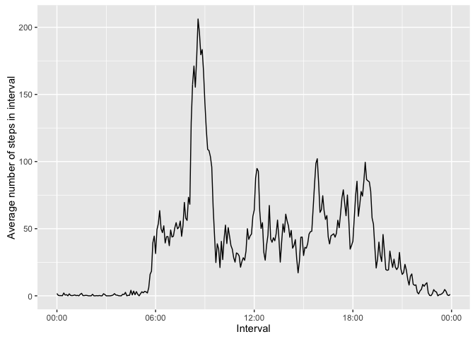
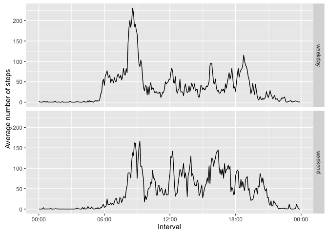

# Reproducible Research: Peer Assessment 1


## Loading and preprocessing the data

The data comes as a zip file containing a single comma-separated values (csv)
file.


```r
# Unpack the data, if not already done
dataName <- "activity.csv"
zipName <- sub(".csv", ".zip", dataName)
if (!file.exists(dataName)) {
    unzip(zipName)
}

dat <- read.csv("activity.csv",
                colClasses=c("integer", "character", "integer"))
str(dat)
```

```
## 'data.frame':	17568 obs. of  3 variables:
##  $ steps   : int  NA NA NA NA NA NA NA NA NA NA ...
##  $ date    : chr  "2012-10-01" "2012-10-01" "2012-10-01" "2012-10-01" ...
##  $ interval: int  0 5 10 15 20 25 30 35 40 45 ...
```

Change the date column to the Date data type.


```r
dat$date <- as.Date(dat$date)
```

From the range of the "interval" variable it looks like that variable codes
hours and minutes in 24-hour format.


```r
range(dat$interval)
```

```
## [1]    0 2355
```

```r
# Just the first two digits
range(floor(dat$interval/100))
```

```
## [1]  0 23
```

```r
# Just the last two digits
range(dat$interval %% 100)
```

```
## [1]  0 55
```

This isn't a very good representation. If we put "interval" on the x-axis of a
plot there would be big gaps between 1255 and 1300, for example, when those two
intervals actually should be right next to each other. Convert "interval" to a
time.


```r
# The sprintf function here makes the number from "interval" 4 digits long
# (e.g. 15 becomes "0015") before trying to interpret it as a time of day.
dat$interval <- as.POSIXct(sprintf("%04d", dat$interval), tz="GMT", "%H%M")
str(dat)
```

```
## 'data.frame':	17568 obs. of  3 variables:
##  $ steps   : int  NA NA NA NA NA NA NA NA NA NA ...
##  $ date    : Date, format: "2012-10-01" "2012-10-01" ...
##  $ interval: POSIXct, format: "2017-01-21 00:00:00" "2017-01-21 00:05:00" ...
```


## What is mean total number of steps taken per day?

Filter out missing values, then group by date, then sum up steps on each date.


```r
library(dplyr)
stepsByDay <- dat %>% filter(complete.cases(.)) %>% group_by(date) %>%
    summarize(steps=sum(steps))
library(ggplot2)
qplot(stepsByDay$steps, geom="histogram", xlab="Number of steps in a day")
```

<!-- -->

```r
stepsByDaySummary <- summary(stepsByDay$steps)
meanStepsByDay <- round(stepsByDaySummary["Mean"])
medianStepsByDay <- round(stepsByDaySummary["Median"])
```

The mean number of steps per day is 10770.
The median number of steps per day is 10760.


## What is the average daily activity pattern?


```r
stepsByInterval <- dat %>% filter(complete.cases(.)) %>% group_by(interval) %>%
    summarize(steps=mean(steps))

# Use the scales library to be able to format the x-axis as just times.
library(scales)
ggplot(stepsByInterval, aes(x=interval, y=steps)) +
    geom_line() +
    labs(x="Interval", y="Average number of steps in interval") +
    scale_x_datetime(labels=date_format("%H:%M"))
```

<!-- -->

```r
intervalWithMaxSteps <- dat[which.max(stepsByInterval$steps),]$interval
```

Interval 0835 contains the
maximum number of steps.


## Imputing missing values


```r
nrowMissingValues <- nrow(dat) - sum(complete.cases(dat))
```

There are 2304 rows with missing values.

We will fill in missing values by using the mean number of steps for that
interval. We will do this in 3 steps:

1. Get the mean number of steps for each interval.
2. Create a new data set by merging the original table with the mean number of
   steps table.
3. Create a new column with no NA's by taking the value of "steps" from the
   original table, *or* if that is NA, the value from the column we added in
   step 2.


```r
meanSteps <- dat %>% filter(complete.cases(.)) %>% group_by(interval) %>%
    summarize(meanSteps=mean(steps))
newDat <- left_join(dat, meanSteps, by=c("interval"))
newDat$imputedSteps <- ifelse(is.na(newDat$steps), newDat$meanSteps, newDat$steps)
```

Now repeat the histogram from the first question above to check how much of a
difference imputing the data made.


```r
newStepsByDay <- newDat %>% group_by(date) %>% summarize(steps=sum(imputedSteps))
library(gridExtra)
plot1 <- qplot(stepsByDay$steps, geom="histogram", fill=I("blue"),
               main="Original (Ignore NA)",
               xlab="Number of steps in a day")
plot2 <- qplot(newStepsByDay$steps, geom="histogram", fill=I("purple"),
               main="With Imputed Values",
               xlab="Number of steps in a day")
grid.arrange(plot1, plot2, ncol=2)
```

<!-- -->

The new plot looks like the old except for some higher bars in the middle. Were
entire days that were all NA before are being filled in? To check that:


```r
length(unique(stepsByDay$date))
```

```
## [1] 53
```

```r
length(unique(newStepsByDay$date))
```

```
## [1] 61
```

The data set with imputed values has 8 days that were not there before (they
were all NA's).


```r
newStepsByDaySummary <- summary(newStepsByDay$steps)
newMeanStepsByDay <- round(newStepsByDaySummary["Mean"])
newMedianStepsByDay <- round(newStepsByDaySummary["Median"])
```

The new mean number of steps per day is 10770
(old was 10770).  
The new median number of steps per day is 10770
(old was 10760).  
This is close to the original so using means by interval seems like a
workable way to impute data.


## Are there differences in activity patterns between weekdays and weekends?


```r
newDat$dayOfWeek <- weekdays(newDat$date)
newDat$weekdayOrWeekend <- as.factor(ifelse(newDat$dayOfWeek=='Saturday' |
                                            newDat$dayOfWeek=='Sunday',
                                            'weekend', 'weekday'))
head(newDat)
```

```
##   steps       date            interval meanSteps imputedSteps dayOfWeek
## 1    NA 2012-10-01 2017-01-21 00:00:00 1.7169811    1.7169811    Monday
## 2    NA 2012-10-01 2017-01-21 00:05:00 0.3396226    0.3396226    Monday
## 3    NA 2012-10-01 2017-01-21 00:10:00 0.1320755    0.1320755    Monday
## 4    NA 2012-10-01 2017-01-21 00:15:00 0.1509434    0.1509434    Monday
## 5    NA 2012-10-01 2017-01-21 00:20:00 0.0754717    0.0754717    Monday
## 6    NA 2012-10-01 2017-01-21 00:25:00 2.0943396    2.0943396    Monday
##   weekdayOrWeekend
## 1          weekday
## 2          weekday
## 3          weekday
## 4          weekday
## 5          weekday
## 6          weekday
```

```r
# This plot will be much like the average daily activity pattern plot above,
# but it needs to include the weekdayOrWeekend variable in the group_by.
stepsByInterval <- newDat %>% group_by(interval, weekdayOrWeekend) %>%
    summarize(imputedSteps=mean(imputedSteps))

ggplot(stepsByInterval, aes(x=interval, y=imputedSteps)) +
    geom_line() +
    facet_grid(weekdayOrWeekend ~ .) +
    labs(x="Interval", y="Average number of steps") +
    scale_x_datetime(labels=date_format("%H:%M"))
```

<!-- -->

This plot suggests that:

- People get going earlier on weekdays (around 6am compared to around 8am on
  weekends).
- Activity is more evenly spread throughout the day on weekends (the spikes are
  not as extreme).
- People stay active slightly longer on weekends (with the last spike in
  activity occuring around 8pm compared to 7pm on weekdays).
